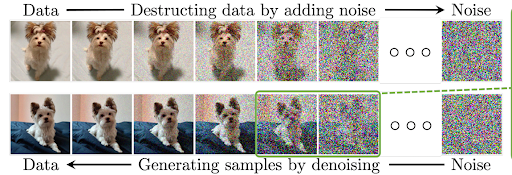
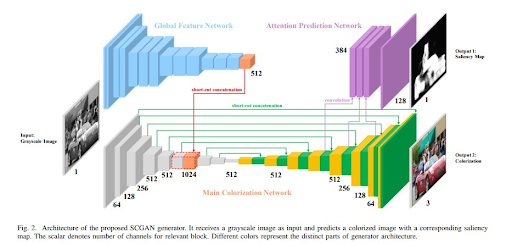

# HueShift: Breathing Life into Every Frame

HueShift transforms grayscale videos into vibrant color using two different deep learning approaches: Diffusion Models and Generative Adversarial Networks (GANs). Our goal was to develop and compare these methods, with a special focus on ensuring **temporal consistency** and realistic coloration across frames.


https://github.com/user-attachments/assets/c31369b7-bd1a-4be6-8e65-bb0a443d37d8


## Our Dual Approach

### 1. Diffusion-Based Approach
<br>
<p align="center">
    
    <p align="center">Diffusion Process</p>
</p>

Our diffusion model works by iteratively adding and removing noise:

* **LAB Color Space Processing** - Separates luminance ("L" channel) from color ("A" and "B" channels), allowing us to denoise only color components
* **U-Net Architecture** - A 3-channel LAB input with noised AB channels passes through encoder, bottleneck, and decoder with skip connections
* **Noise Scheduling** - Carefully calibrated variance schedule controls the noise addition/removal process
* **Forward Process** - Gaussian noise is added to color channels in increasing amounts over T timesteps
* **Reverse Process** - The model learns to predict and remove noise iteratively, conditioned on grayscale input
* **Resolution Enhancement** - Bicubic interpolation upscales low-resolution outputs while preserving original grayscale details
* **Neural Deflickering** - Flawed atlas approach identifies and corrects temporal inconsistencies between frames

Our model was trained on vast.ai GPUs using keyframes from the UCF101 dataset. The diffusion process allows for high-quality colorization by gradually learning to reverse the noise addition process, guided by the grayscale input.


### 2. GAN-Based Approach
<br>
<p align="center">
    
    <p align="center">GAN Architecture</p>
</p>

Our GAN implementation uses saliency maps to guide colorization:

* **SCGAN-Based Generator** - Modified with channel reduction at deeper layers for improved training stability
* **Saliency Detection** - Pyramid Feature Attention Network identifies visually important regions
* **70×70 PatchGAN Discriminators**:
  * Standard discriminator - Enforces global color realism
  * Attention discriminator - Focuses on salient regions for detail refinement
* **Loss Functions** - Balanced combination of adversarial, L1, and perceptual losses
* **Optical Flow** - FastFlowNet tracks motion between frames to maintain color consistency
* **Adaptive Color Propagation** - Warps colors from keyframes to subsequent frames based on motion vectors

We deviated from the original SCGAN design by reducing channel counts as network depth increased, improving efficiency and reducing overfitting. The dual-discriminator setup enhances both global color realism and local detail accuracy.

## Technical Challenges

### Achieving Temporal Consistency

Our videos were deflickered through a two-stage neural approach:

#### Atlas Generation Stage
Video frames were processed by mapping each pixel's (x,y,t) coordinates to a consistent 2D atlas space using a 6-layer MLP network without positional encoding. Colors were reconstructed using an 8-layer MLP with positional encoding at 10 frequency bands. This mapping was optimized through a combination of RGB reconstruction loss (weight 5000), optical flow consistency loss (weight 500), rigidity loss (weight 1.0), and gradient preservation loss (weight 1000) for 10,000 iterations at 768×432 resolution.

#### Neural Filtering Stage
The second stage applied a UNet-based neural filter with 32 initial features followed by a TransformNet with ConvLSTM for temporal consistency. This refined the atlas-reconstructed frames to preserve details while maintaining temporal consistency. The final output, stored in the "final" directory at the original resolution, shows the video with flickering successfully removed while preserving natural motion and details.


https://github.com/user-attachments/assets/75e857e4-b31e-4816-a28a-c7d75d08deff

## Setup and Installation

1. Clone the repository
2. Create a virtual environment:
   ```
   python -m venv venv
   ```
3. Activate the virtual environment:
   - Windows: `venv\Scripts\activate`
   - macOS/Linux: `source venv/bin/activate`
4. Install dependencies:
   ```
   pip install -r requirements.txt
   ```
5. Run the application:
   ```
   python app.py
   ```
6. Open your browser and navigate to `http://127.0.0.1:5000/`

## References & Resources

* [Denoising Diffusion Probabilistic Models](https://arxiv.org/abs/2006.11239) - The foundation for our diffusion-based approach
* [Blind Video Deflickering by Neural Filtering with a Flawed Atlas](https://arxiv.org/abs/2303.08120) - Used for ensuring temporal consistency in our diffusion approach
* [SCGAN: Saliency Map-guided Colorization with Generative Adversarial Network](https://arxiv.org/abs/2011.11377) - The basis for our GAN-based approach
* [Diffusion Approach GitHub](https://github.com/Kazedaa/Hueshift-Video-Coloring)
* [GAN Approach GitHub](https://github.com/SreeDakshinya/HueShift-Video-Coloring/tree/main)

### Additional References
* [DeOldify](https://github.com/jantic/DeOldify?tab=readme-ov-file#what-is-nogan) - NoGAN Based Implementation
* [Colorization of black-and-white images using deep neural networks](https://core.ac.uk/download/pdf/151072499.pdf)
* [Video Colorization with Pre-trained Text-to-Image Diffusion](https://arxiv.org/pdf/2306.01732v1)
* [Deep Exemplar-Based Video Coloring](https://arxiv.org/pdf/1906.09909v1)
* [Diffusion based image coloring using Piggybacked models](https://arxiv.org/pdf/2304.11105)
* [SwinTExCo: Exemplar-based video colorization using Swin Transformer](https://www.sciencedirect.com/science/article/pii/S0957417424023042)

## Team

### Mentors
- Aditya Ubaradka
- Aishini Bhattacharjee
- Hemang Jamadagni
- Sree Dakshinya

### Mentees
- Akhil Sakhtieswaran
- Swaraj Singh
- Vanshika Mittal

